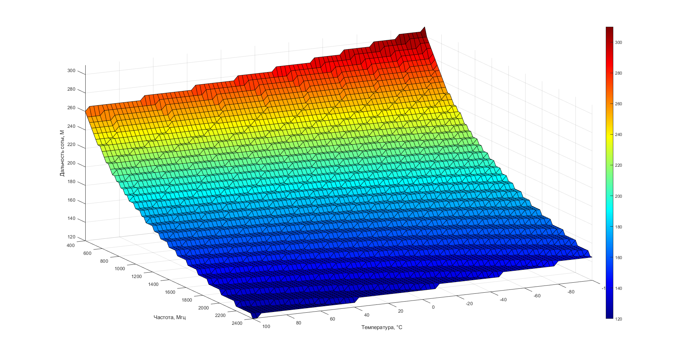
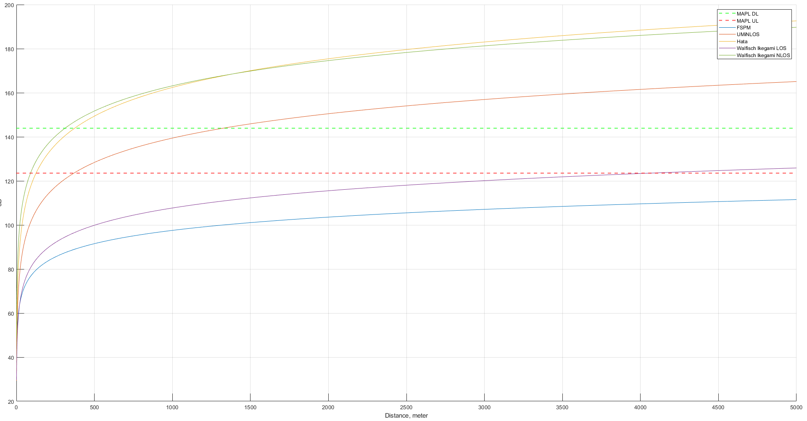

# README — Расчёт радиуса действия соты и радиобюджета

Данная работа посвящена расчёту радиопокрытия базовой станции (macro/micro/femto) на основе моделей распространения радиосигнала и бюджета линий связи (UL/DL). В лабораторной используется MATLAB.

## Что выполняется в работе

1. **Задание исходных параметров сети**, включая мощность передатчиков, коэффициенты усиления антенн, потери в фидерах, шумовые характеристики приёмника (Noise Figure), требуемый SINR и параметры канала.

2. **Расчёт теплового шума**:
   $$ThermalNoise = -174 + 10 \log_{10}(BW)$$

3. **Определение чувствительности приёмника (RxSens)**:
   $RxSens = NoiseFigure + ThermalNoise + RequiredSINR$

4. **Расчёт максимальных приемлемых потерь (MAPL)** для восходящего канала (UL) на основе:

   * FSPM (Free Space Path Model)
   * UMi NLOS
   * COST 231 Hata
   * Walfisch–Ikegami

5. **Вычисление пути распространения сигнала** с использованием выбранных моделей и параметров: расстояние до абонента, частота, высоты антенн, потери от застройки и ориентации улиц.

6. **Получение радиуса действия соты** как максимального расстояния, при котором:
   $$MAPL \ge PathLoss$$

## Результат работы

В результате вычислений определяется:

* **RxSens** приёмника BS/UE
* **MAPL для различных моделей распространения**
* **Максимальный радиус покрытия одной соты**
* Сравнение моделей между собой
* График дальности макросоты по модели Окумура - Хата

